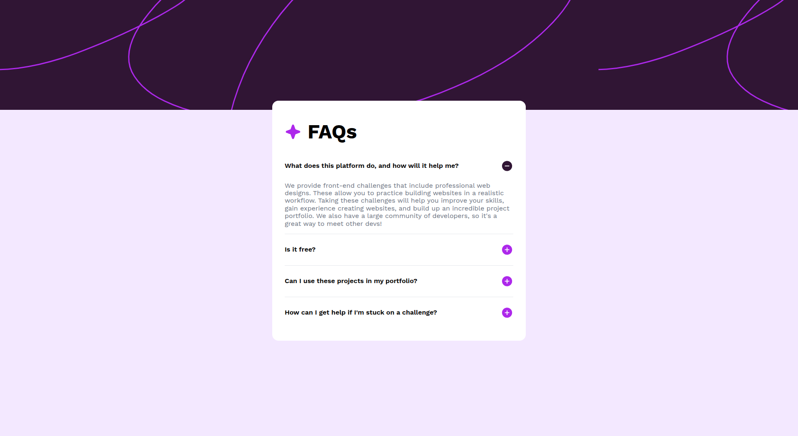
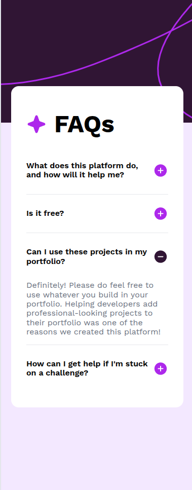

# Frontend Mentor - FAQ accordion solution

This is a solution to the [FAQ accordion challenge on Frontend Mentor](https://www.frontendmentor.io/challenges/faq-accordion-wyfFdeBwBz). Frontend Mentor challenges help you improve your coding skills by building realistic projects.

## Table of contents

- [Overview](#overview)
  - [The challenge](#the-challenge)
  - [Screenshot](#screenshot)
  - [Links](#links)
- [My process](#my-process)
  - [Built with](#built-with)
  - [What I learned](#what-i-learned)
  - [Continued development](#continued-development)
  - [Useful resources](#useful-resources)

## Overview

It is a easy challendge (lvl 1 of 5) where you can do basic ui accordion on native Html, Css, Javascript.

### The challenge

Users should be able to:

- Hide/Show the answer to a question when the question is clicked
- Navigate the questions and hide/show answers using keyboard navigation alone
- View the optimal layout for the interface depending on their device's screen size
- See hover and focus states for all interactive elements on the page

### Screenshot

### Links

- Solution URL: [Github](https://github.com/CrabF/basicAccordion)
- Live Site URL: [Deploy](https://crabf.github.io/basicAccordion/)

## My process

Initially, I implemented a lightweight structure using only essential index files of different types. During development, I encountered an issue when using the 
 and 
 HTML tags. While these tags provide built-in show/hide functionality, they presented limitations for implementing animations.

The standard animation approach using max-height with CSS transitions proved incompatible with these native HTML elements. This required me to prevent their default behavior, which ultimately made the implementation more complex than simply using 
 elements with custom animations.

Consequently, I refactored the solution to use 
 elements instead, which provided better control over the animation behavior.

In the final implementation, I ensured full keyboard accessibility. When an element receives focus, users can press the spacebar to toggle content visibility (show/hide functionality).

### Built with

- Semantic HTML5 markup
- CSS custom properties
- Flexbox
- Native Javascript

### What I learned

This was my first experience implementing accessibility features. Through this project, I gained fundamental knowledge about keyboard navigation patterns (Tab, Space).

I experimented with 
 and 
 elements as a progressive enhancement approach. These tags provide native show/hide functionality that works even when JavaScript is disabled, though I discovered some limitations with custom animations.

### Continued development

I consider this project logically complete.

### Useful resources

- [JavaScript Focus Events Guide](https://learn.javascript.ru/focus-blur) - Essential reference for implementing focus behavior on non-interactive elements like 
.
- MDN Web Docs - Helped me understand the 
 element's limitations
